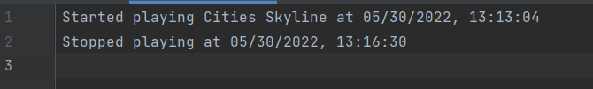

# usageTracker

An app to stop you from playing games too much by reminding you how much you played
(only works on windows)

## Table of contents

- [How it works](#how-it-works)
- [How to set up](#how-to-set-up)
- [How to find out the process name of the game I play](#how-to-find-out-the-process-name-of-the-game-i-play)
- [How I worked on this project](#how-i-worked-on-this-project)
- [Why I built the project this way](#why-i-built-the-project-this-way)
- [If I had more time I would change this](#if-i-had-more-time-i-would-change-this)

## How it works
When you start your computer, this window will pop up automatically

Then when you starting playing a game listen in config.yaml, it would record it, and make a ding sound

When you have played for a long time, it will remind you by printing this line and reading it out using text to speech

When you exit the game, it would update the info and record when you stopped playing

The data will also be logged under data_files/{datetime}{version}.log

Note that the time is incorrect here because I edited the time for demonstrative purpose

## How to set up
1. install the requirements first by\
`pip install -r requirements.txt`\
[online tutorial](https://note.nkmk.me/en/python-pip-install-requirements/)
   
2. rename `sample_config.yaml` to `config.yaml`

3. fill in your name, as well as game processes and name inside `config.yaml`

4. add this app to run on start up, for Windows 10, the [process](https://support.microsoft.com/en-us/windows/add-an-app-to-run-automatically-at-startup-in-windows-10-150da165-dcd9-7230-517b-cf3c295d89dd) is:

    a) Select the Start  button and scroll to find the app you want to run at startup.

    b) Right-click the app, select More, and then select Open file location. This opens the location where the shortcut to the app is saved. If there isn't an option for Open file location, it means the app can't run at startup.

    c) With the file location open, press the Windows logo key  + R, type shell:startup, then select OK. This opens the Startup folder.

    d) Copy and paste the shortcut to the app from the file location to the Startup folder.

5. You're good to go

## How to find out the process name of the game I play

1. Open task manager

2. Find the game you play, expand it, right click and find open details

   
3. There you can find the process name

## How I worked on this project

After having this idea, I first had to figure out how to know if a game is running or not, I decided to use `psutil` package to check what processes are running.

Now that I know what process are running, I have to find out what process is the game, which is fortunately easy with task manager.

Then, I had to record when the starts. I thought about using an event handling method. But I figured it would be easier just to iterate through all processes every 1 minute, and see when does the game process starts running.

Now I want to remember the user that they have been playing for a while. I thought about recording the speech myself, but it would need a lot of audio manipulation since I have to say every number from 15, 30, to 30 onwards.

So I decided to use Google text-to-speech to saw the line. I don't want to make excess request to I decided to cache the result. Meaning if `You have been playing for 41 minutes` was requested before, it would just use the old file instead of making a new request to google text-to-speech.

I also decided to log the play and stop timestamp in case I want to analyse them later

## Why I built the project this way

One of the design decision is to have it as a python script, instead of a batch script, or exe.

I did this because Python is easy to install, and I can make it produce log, play music very easily.

## If I had more time I would change this

I would analyse the data in the log and see the play time trend.

I might also make a force shut down function in the user continues playing for too long, like in 100 minutes, I would play a warning message like `You have been playing for 100 minutes, the process will be force shut down in 5 minutes, please save your progress now`, then kill the process 5 minutes afterwards.